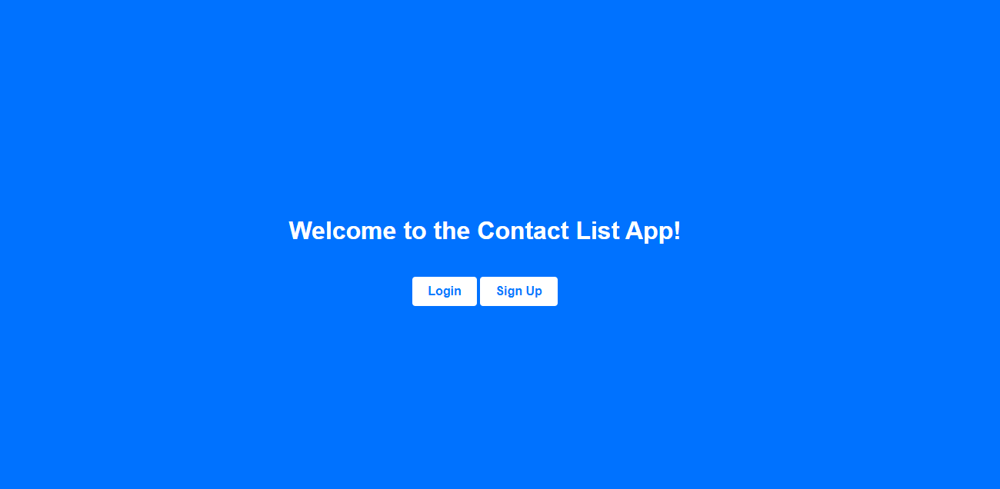
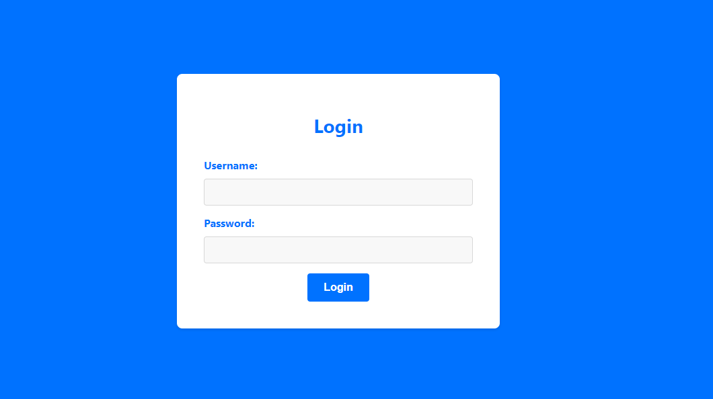
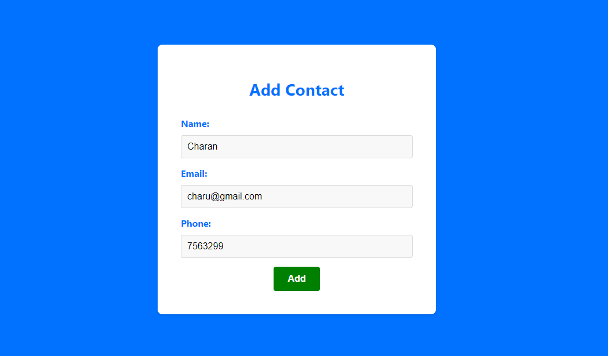
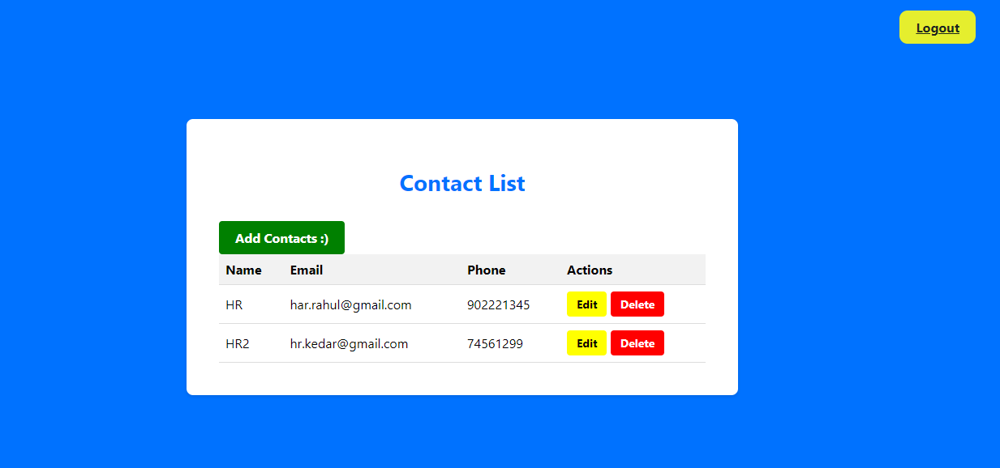
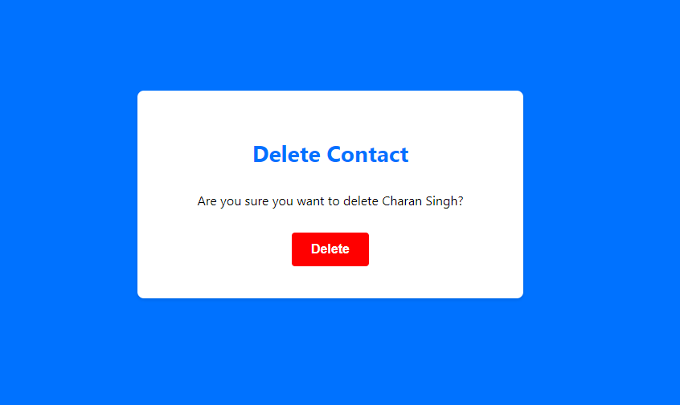

# Contact List Django Project
<big><strong><em>[Live Demo (click here)](https://contact-list-seven-henna.vercel.app/)</em></strong></big>

This is a simple contact list management web application built with Django. It provides authentication features for user login and signup, as well as contact management functionalities such as adding, editing, and deleting contacts.

## Features

- User authentication: Users can sign up and log in to their accounts.
- Contact List: Display a list of contacts created by the logged-in user.
- Add Contact: Users can add new contacts by providing contact details.
- Edit Contact: Allow users to modify existing contacts.
- Delete Contact: Users can delete contacts from their contact list.

## Technologies Used

- Django: a Python web framework for building web applications.
- SQLite: a lightweight database for development purposes.
- HTML/CSS: for the frontend user interface.

